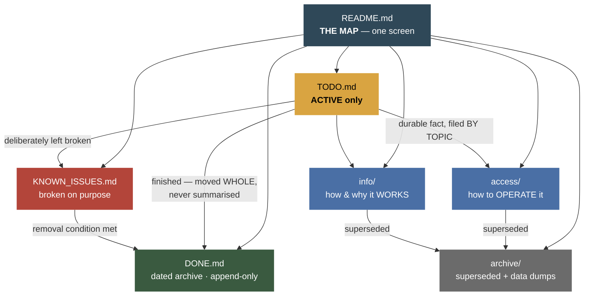

# The Docs Standard — one shape for every project

> **Audience:** every future AI session (Claude, Kiro, anything else) and the
> owner. **Status:** TRACKED.
> Last verified: **2026-08-21**.
>
> ⚠️ **§1–§8 ARE GENERIC AND PORTABLE. Copy this file into any project
> unchanged.** Nothing in them names a company, a stack, a service or a repo.
> **§9 is the only project-specific section** — replace it wholesale when you
> copy this file, and never let project detail leak upward into §1–§8.
>
> The same rules are stated in short normative form in the user's global
> `~/.claude/CLAUDE.md`. That is deliberate and is **not** the "two living
> copies" problem: the global rule is the SHORT form that travels with the
> operator, this file is the LONG form that travels with the project — and a
> cloned repo has this file when it does not have the operator's home
> directory. ⚠️ **If they ever disagree, the global rule wins on the RULES and
> this file wins on the DETAIL. Do not "helpfully" merge them.**

This is the **one** place the rules live. Every repo's `docs/README.md` points
here instead of restating them, because a rule written down twice is a rule that
will disagree with itself.

---

## 0. ⚠️ IF A PROJECT DOES NOT HAVE THIS STRUCTURE, BUILD IT — before other work

**Owner rule, 2026-08-21:** every project, new **and existing**, adopts this
shape. Meeting a repo that does not have it is not a reason to skip the rule; it
is the trigger for it.

**On opening any project, check for the seven things in §1. For each one that is
missing, create it before starting the task you came to do.** A stub with the
standard header counts — better a scaffold a later session fills than a
structure nobody starts.

⚠️ **Adopting the shape in an EXISTING project is a migration, not a `mkdir`.**
Almost every repo already has the content; it is in the wrong shape. In order:

1. **Create the missing files** — `README.md` (the map), `KNOWN_ISSUES.md`,
   `archive/`. Most projects already have `TODO.md`, `DONE.md`, `access/`,
   `info/`.
2. **Clear the top level.** Anything loose at the root of `docs/` that is not
   one of the four logs moves into `access/`, `info/` or `archive/`. ⚠️ **Repair
   the inbound links in the same commit** — `grep -rn "docs/<OLDNAME>"` across
   the repo, including code and root `README.md`, not just `docs/`.
3. **Retire the competing living docs.** A `HANDOFF.md`, a `NOTES.md`, a
   model-specific queue — anything that is a *second* place "current state"
   lives. Its finished sections go to `DONE.md`, its live ones to `TODO.md`,
   its durable facts to `access/`/`info/`, and the husk to `archive/` with a
   dated banner (§6). ⚠️ **Move sections WHOLE. Never summarise.**
4. **Seed `KNOWN_ISSUES.md` with real entries, not placeholders.** Every project
   has three or four things that are broken on purpose; if you cannot name one,
   you have not looked. An empty known-issues file teaches the next session that
   there are no known issues, which is a lie by omission.
5. **Only then start the work you came for**, and say in your first substantive
   reply what you created and what was already there.

⚠️ **Do NOT do a bulk `TODO.md` → `DONE.md` sweep by heading.** Measured
2026-08-21 on this very repo: 11 sections carried `LIVE` / `SHIPPED` / `✅` in
the heading and **every one of them had open work in the body**. Read the body.
The heading is usually the stale half.

**The one exception:** a scratch directory with no `docs/` at all and a
one-off question. If the project HAS docs, there is no exception.

---

## 1. The tree — every repo, the same seven things

```
docs/
├── README.md          ← THE MAP. Front door. One screen. Links everything below.
├── TODO.md            ← ACTIVE work only. If it is finished it is not here.
├── DONE.md            ← Dated archive, newest first. APPEND ONLY.
├── KNOWN_ISSUES.md    ← Accepted defects, waivers, exceptions. NOT a work log.
├── access/            ← HOW TO OPERATE it.  README.md is its index.
├── info/              ← HOW AND WHY it works. README.md is its index.
└── archive/           ← Superseded documents and one-off data dumps.
```

Nothing else lives at the top of `docs/`. A loose `.md` at that level is a bug —
it belongs in `access/`, `info/`, `archive/`, or one of the three logs.

⚠️ **Two files are exempt** because tooling writes them: `deploys.log`
(append-only deploy record) and any `*.log` a script produces.

### The same thing as a graph — how the pieces feed each other

The tree above says where files sit. This says **how work moves between them**,
which is the part that actually gets done wrong.



⚠️ **Read the arrows out of `TODO.md` carefully — there are four of them, and
using the wrong one is the most common failure in this whole standard.** A
finished item goes to `DONE.md`; a fact you learned goes to `access/` or `info/`
by topic; something you knowingly left broken goes to `KNOWN_ISSUES.md`. Only
the first is "done". Leaving all four in the work log is how a work log becomes
1,700 lines nobody reads.

⚠️ **Nothing ever flows back OUT of `DONE.md`.** If an archived entry turns out
to be wrong, you append a new one that supersedes it — you do not edit history.

---

## 2. What goes where — the decision, in one table

Ask **"what question does this answer?"**, never "what is it about?".

| The question it answers | Where it goes |
|---|---|
| *What is happening right now? What is blocked?* | `TODO.md` |
| *Was this solved before, and why that way?* | `DONE.md` |
| *Is this a bug, or is it like that on purpose?* | `KNOWN_ISSUES.md` |
| *How do I run / deploy / reach / rotate this?* | `access/` |
| *How does this work, and why is it built this way?* | `info/` |
| *What did this look like before?* | `archive/` |

⚠️ **The most common filing error is putting durable reference in the work
log.** A gotcha, a measured number, or a design rationale is not "current work"
just because you learned it today. It goes to `info/` (or `access/`), findable by
topic, and the work log links to it.

---

## 3. The four rules that are not negotiable

### 3.1 An item moves ONCE, at completion, and moves WHOLE

Cut and paste from `TODO.md` into `DONE.md`. **Never summarise on the way out** —
the summary always drops the *why*, and the why is the only reason to keep
history at all.

⚠️ **Marking an item "✅ DONE" inside `TODO.md` is the anti-pattern this rule
exists to kill.** Done items do not get a badge; they get MOVED, in the same
working session the work completes — ideally the same commit. A report that
announces a completion while the item still sits in `TODO.md` is reporting the
work as finished when its paperwork is not.

*Measured 2026-08-21: a section titled "BUILT, NOT DEPLOYED" whose body said
"✅ COMMITTED AND DEPLOYED 2026-08-20, verified live across 26 pages" had been
sitting in an active list for a day. A heading keeps asserting whatever it said
the hour somebody typed it.*

### 3.2 `DONE.md` is an ARCHIVE, not a living doc

**Append only. Newest first. Nothing there is ever edited or re-summarised.**
It exists so a future session does not re-discover a solved problem, or re-argue
a settled decision. If something in `DONE.md` turns out to be wrong, you do not
correct it — you add a new entry that supersedes it and says so.

### 3.3 One fact, one home — cross-link, never duplicate

If two files would both state a fact, one of them owns it and the other links.
Duplicated facts do not stay equal; they drift, and then a session has to guess
which copy is true.

### 3.4 Every doc carries a header block

```markdown
# <Topic> — <Access|Information> Reference

> **Audience:** Claude sessions. **Status:** TRACKED | LOCAL ONLY (gitignored).
> Last verified: **YYYY-MM-DD**.
```

**"Last verified" is a promise about measurement, not a save date.** Update it
when you actually re-checked the facts, and say in the same line what you did
NOT check.

---

## 4. Writing style — what makes these readable to both audiences

Written for a **future session first, the owner second**. Those wants coincide
more than they diverge: both want the answer fast and want to know how much to
trust it.

- **Titled by SYMPTOM, not by subsystem.** `"the fix didn't deploy"` finds the
  caching doc; `"Caching Architecture"` does not.
- **Tables and short command blocks over prose.** A table is scannable by a
  person and parseable by a model.
- **⚠️ marks a trap; 🔴 marks something that will cost real money, data, or
  trust; ✅ marks a measured pass.** Use them sparingly enough that they still
  mean something.
- **State the measurement, its date, and its instrument.** "1,206 items,
  measured 2026-08-21 off the source API" beats "about 1,200 items".
- ⚠️ **Say what was NOT verified.** Every report, every doc. An unavailable fact
  is reported unavailable, never filled in with something plausible.
- **Keep the gotcha that cost real time.** It is the single highest-value
  content in the whole tree.
- **Never paste a secret VALUE.** Names only, everywhere, in every repo.

---

## 5. `KNOWN_ISSUES.md` — what belongs there, and what does not

This is the file that stops the same non-bug being re-reported every month.

**It holds:** accepted defects nobody is fixing yet; deliberate waivers; known
exceptions and the reason for each; environment quirks that look like faults;
and anything a newcomer would reasonably file as a bug.

**It does NOT hold:** work in flight (that is `TODO.md`), or traps you fall into
while working (those are `info/gotchas.md` — a gotcha is something you *do*
wrong; a known issue is something that *is* wrong and is tolerated).

Every entry carries four things:

| Field | Why |
|---|---|
| **Symptom** | What a person actually sees. It is how the entry gets found. |
| **Status** | `ACCEPTED` · `WAIVED` · `BLOCKED` · `WATCHING` |
| **Why it is tolerated** | The argument. Without it the entry reads as neglect. |
| **What would change it** | ⚠️ The removal condition, ideally a NUMBER, not a judgement call. |

---

## 6. `archive/` — how to retire a document without deleting it

A doc that has been superseded moves to `docs/archive/` with a dated suffix and
**one line at the top saying what replaced it**. Big one-off data dumps
(migration snapshots, `.jsonl` logs, CSV audits) go there too — they are evidence,
not documentation, and they make a `docs/` listing unreadable.

```markdown
> ⚠️ **ARCHIVED 2026-08-21 — superseded by [`../info/foo.md`](../info/foo.md).**
> Kept for the reasoning, not as current fact. Do not act on anything here.
```

⚠️ **Archiving is not deleting, and the difference is load-bearing.** The
history behind this rule includes an archived shim that kept telling readers a
problem was "still on hold" months after it was fixed — a retired doc that does
not say it is retired is worse than one that was deleted.

---

## 7. `docs/README.md` — the map

One screen. It exists so a session can orient in a single read, and so the owner
can find something without knowing which folder it is in. It carries:

1. A one-paragraph statement of what this project *is*.
2. The tree, as a diagram.
3. A "start here" table: the 3–5 docs that answer the most common questions.
4. Links to the two indexes and the three logs.
5. A pointer to this file for the rules.

⚠️ **It does not restate the rules and it does not duplicate the indexes.**

---

## 8. The session checklist

**Opening a session** (this is enforced by a `SessionStart` hook):

1. `docs/README.md` — the map
2. `docs/TODO.md` — what is active
3. `docs/KNOWN_ISSUES.md` — so you do not "fix" something deliberate
4. The `access/` and `info/` files your task touches
5. `docs/DONE.md` only to check whether something was already solved

In a multi-repo checkout this means **every** repo's `docs/`.

**Closing a piece of work — all four, or the work is not landed:**

1. Move the finished item **whole** into `DONE.md`.
2. Update the `access/` or `info/` doc whose facts changed, and its
   *Last verified* date.
3. Add a `KNOWN_ISSUES.md` entry for anything you deliberately left broken.
4. Say what you did **not** verify.

---

## 9. ⚠️ PROJECT-SPECIFIC — replace this whole section when you copy this file

*Everything above is portable. Everything below describes THIS estate only.*

### Where each repo's tree lives, and which are in git

| Repo | `docs/` in git? | Consequence |
|---|---|---|
| `catalog-platform` | ✅ **TRACKED** | Survives a clone. Estate-wide docs and cross-repo queues belong here |
| `audiobook_catalog` | ❌ gitignored (`.gitignore:7`) | 🔴 Exists on the owner's machine and nowhere else — see the backup below |
| `library_catalog` | ⚠️ **mixed** — some tracked | Check `git check-ignore` before assuming |
| `Board_Game_Catalog` | ⚠️ check per file | Same |

🔴 **Because three of the four are local-only, `docs/` is backed up to R2.**
`catalog-platform/scripts/backup-docs.mjs` archives all four trees to
`estate-backups/docs/<repo>/<UTC>.json.gz`; `restore-docs.mjs` puts one back.
Drilled 2026-08-21 — byte-exact round trip. Runbook:
[`access/backup-restore.md`](access/backup-restore.md) §6b.

⚠️ Those archives contain `access/keys/` — **raw** service-account JSON and
bearer tokens. They are key material, not documents.
