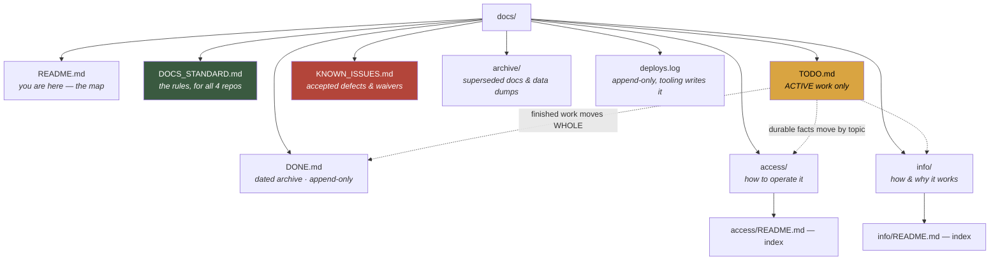

# catalog-platform — docs map

> **Audience:** Claude/Kiro sessions first, the owner second. **Status:** TRACKED.
> Last verified: **2026-08-21** (the tree below was measured that day).
>
> 📐 **The rules for this tree — filing, formatting, when to move things — live
> in [`DOCS_STANDARD.md`](DOCS_STANDARD.md), and ONLY there.** All four repos
> follow it. Read it once; do not restate it anywhere else.

**What this project is:** the estate's shared platform — the auth/SSO Worker and
member directory, the Discord bot (GABI), the cross-catalog index, the
`heygabi.ai` front door with its `/status` pages, and the backup machinery that
protects every store in the estate. It is also the **only one of the four docs
trees kept in git**, so anything estate-wide is written down here.

---

## The tree

---

## Start here

| If you want to know… | Read |
|---|---|
| **What is active right now** | [`TODO.md`](TODO.md) — including **"KIRO — COMPLETE THIS WORK"**, the ranked hand-off queue |
| **Is this a bug or deliberate?** | [`KNOWN_ISSUES.md`](KNOWN_ISSUES.md) |
| **How do I deploy / rotate a key / restore a backup** | [`access/README.md`](access/README.md) |
| **Why is it built this way** | [`info/README.md`](info/README.md) |
| **Was this already solved** | [`DONE.md`](DONE.md) — newest first |
| **What broke, when, and what shipped** | `deploys.log` — the 3am rollback source of truth |

## The estate's other three trees

⚠️ **They are LOCAL to the owner's machine** (gitignored, wholly or partly), so
a clone of this repo does not contain them. All four are backed up to R2 —
`scripts/backup-docs.mjs`, restore drilled 2026-08-21, runbook in
[`access/backup-restore.md`](access/backup-restore.md) §6b.

| Repo | Covers |
|---|---|
| `bookbuddy/audiobook_catalog/docs/` | The audiobook pipeline, the shelf server, ebooks, book clubs |
| `bookbuddy/library_catalog/docs/` | The physical/print catalogue and its second instance |
| `boardbuddy/Board_Game_Catalog/docs/` | The board-game catalogue |
