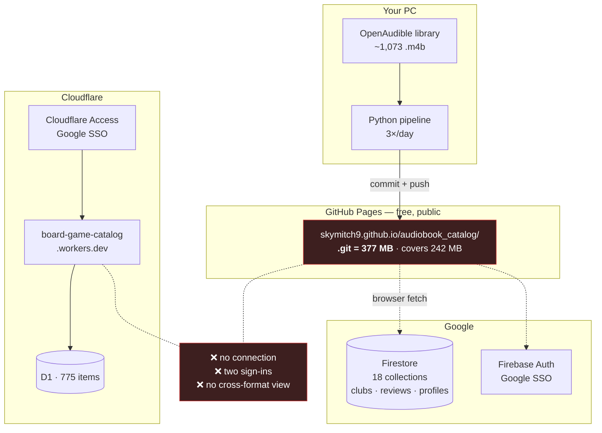
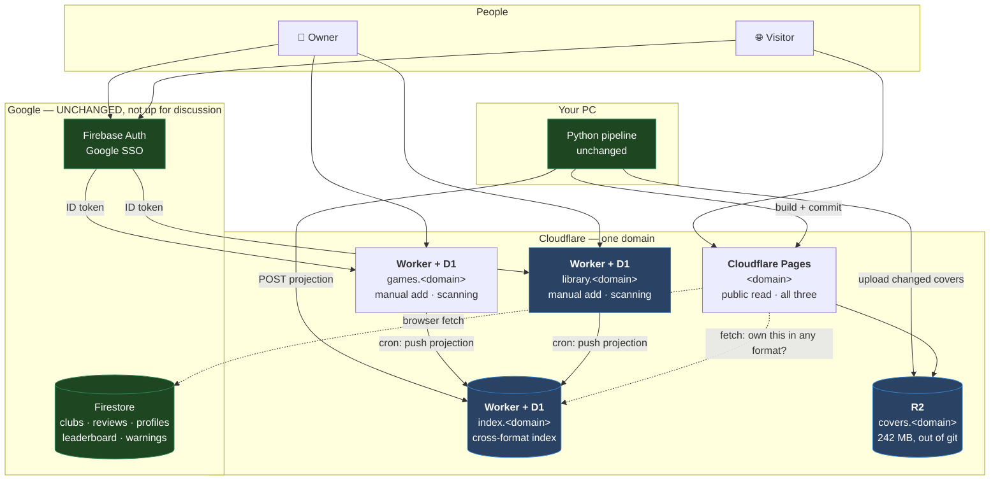
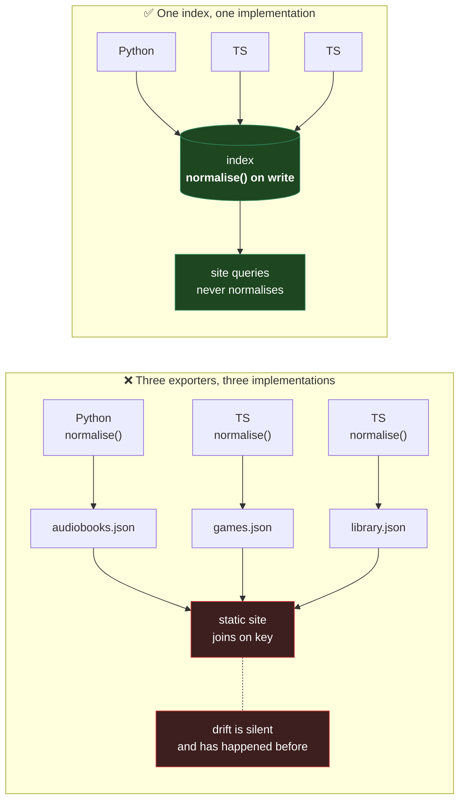
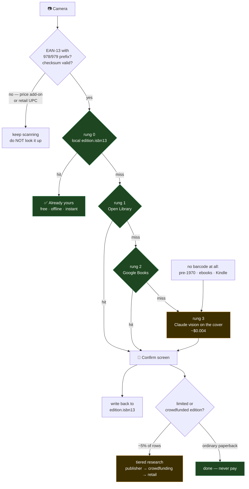
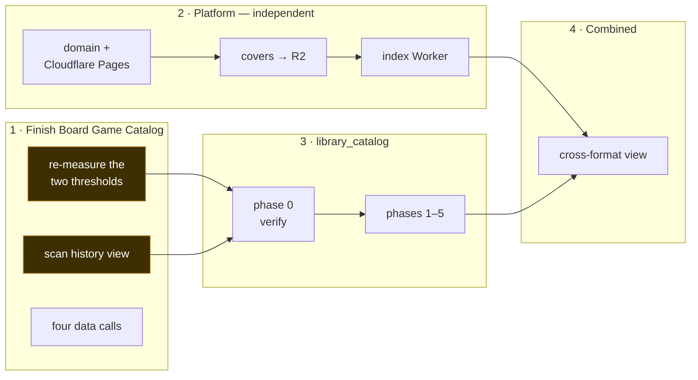

# Diagrams

> **Audience:** Claude sessions. **Status:** PLANNING — none of this is built.
> Last verified: **2026-08-07**. Figures in the "today" diagram were measured on
> that date; everything in the target diagrams is proposed.

Mermaid, matching the convention already used in
`Board_Game_Catalog/docs/DESIGN.md`. Renders in VS Code and on GitHub.

---

## 1. Today

Three catalogs, three hosts, two identity systems, no connection between them.

**What is wrong with it**

| Problem | Evidence |
|---|---|
| Repo approaching the Pages ceiling | `.git` **377 MB** at 378 commits, against a ~1 GB soft limit. Covers regenerate unconditionally every build, so history grows per rebuild |
| Two identity systems | Firebase Auth for audiobooks, Cloudflare Access for games — same Google account, two sessions |
| No cross-format answer | Nothing can say "I own this in audio and paperback" |

---

## 2. Target

Green is untouched. Blue is new.

**Read it as three independent claims**

1. **The pipeline does not change.** It still walks the local library, reads MP4
   atoms and uploads to Drive. It gains two steps: upload changed covers to R2,
   POST a projection to the index.
2. **Firestore does not change.** All 18 collections and ~9,600 lines of
   Firebase-bound JS keep working exactly as they do. This is the constraint
   that makes the whole move cheap.
3. **Each catalog keeps its own database.** The index holds a *projection*, not
   the data. Nothing is merged.

---

## 3. Why an index rather than static JSON exports

The earlier plan had each catalog export a JSON file the static site would join
on `normalise(title)|normalise(author)`. That needs the same normalisation
implemented identically in Python and two TypeScript apps — and this codebase
has already shipped that exact bug, when the Python promote gate and the JS site
resolver drifted on author-splitting and promotes failed silently.

Normalising **once, on write** means the drift cannot happen. The site compares
only strings the index handed it.

---

## 4. The ISBN ladder (library_catalog)

The Board Game Catalog's finding was that barcodes are a *weak* primitive —
measured 2/4 on GameUPC. **For books that reverses**, which is why this ladder
looks inverted compared to `barcode-ladder.md`.

⚠️ **The prefix filter is not optional.** Books usually carry *two* barcodes —
the Bookland EAN-13 and either a 5-digit price add-on or a separate retail UPC
on mass-market paperbacks. A scanner will happily decode the wrong one.

⚠️ **The research gate is not optional either.** `cost-reduction.md` records
what happens without it: asking "what does this row not know" instead of "what
is worth *buying* for this row" put 616 dice trays in front of a web-search
model and cost $8.30.

---

## 5. Sequencing

Amber blocks the fork. Everything in stage 2 is decoupled and can start today.

**Why the thresholds block.** `matchIndexedTitle`'s 60%-containment, title-only
rule is unsafe for books — titles collide across authors constantly, and Kindle
rows carry ASINs rather than ISBNs so they can *only* be matched by name. Fixing
it once in the Board Game Catalog means the fork inherits a correct matcher.
Forking first means fixing it twice, differently.
