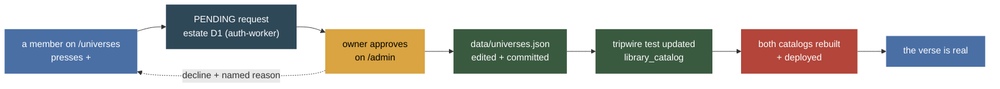

# "+ Add a verse" on /universes — Information Reference

> **Audience:** Claude sessions first, the owner second.
> **Status:** TRACKED — **DESIGN ONLY, nothing built.** No code was written, no
> route exists, no migration was applied.
> Last verified: **2026-08-26** — every file:line below was read this session
> against the working tree at `main` (`ec0cf7c`). ⚠️ **NOT verified:** anything
> live. No request was made to `index.heygabi.ai` or `auth.heygabi.ai`, no D1
> was read, no page was opened in a browser. Effort figures are **labelled
> guesses**, not measurements.

The owner's ask, 2026-08-24, verbatim:

> *"in the universe page add a plus button somewhere to add a verse and let it
> take series as an input"*

---

## 1. ⚠️ Why the button cannot simply "add a verse"

The obvious build — a form that POSTs and a universe appears — is impossible
here, and the reason is not caution. **A universe is not a row anywhere in this
estate.** It is a decision compiled into two catalogs' bundles, pinned by a
test, and the pin is deliberate.

| Fact | Where it is proven |
|---|---|
| The one copy of the list is a FILE in git | `data/universes.json` — 17 universes, `schemaVersion` + `canonicalNames` + `universes[]` + `_refused[]` |
| It is edited by a CLI, never a UI, **on purpose** | `tools/universes.mjs:4-9` — *"Deliberately a CLI and not a web UI: a browser cannot commit to a git repo… A web editor would need a second representation of the list, and two representations drift"* |
| ⚠️ **The CLI CANNOT create a universe** | `tools/universes.mjs:126-129` — *"This CLI does not create or delete universes. Six exist, each with owner sign-off recorded in its `confirmed` field; a seventh is a decision to make in the file, with its evidence, not a command to run."* |
| Every mutating command demands a reason | `tools/universes.mjs:21-22`; `--why` is checked in `tools/lib/universes.mjs` and `saveChecked()` (`tools/universes.mjs:81-95`) refuses a write that would not validate |
| It reaches the catalogs as a **build artifact** | `library_catalog/scripts/sync-universes.mjs:1-24` — materialises into `packages/universes/generated/`, gitignored, rewritten every run, wired as `prebuild`/`pretest`/`pretypecheck` (`library_catalog/package.json:15,36,38`) |
| ⚠️ **A TRIPWIRE TEST fails if the list changes** | `library_catalog/packages/core/test/universes.test.ts:347-380` — `assert.deepEqual(universeNames, [...17 names...])`, whose own comment says: *"This assertion failing is this file WORKING: a universe cannot appear in catalog-platform without a decision landing here too."* |
| A second tripwire forbids a second registry | `library_catalog/packages/core/test/universes-single-writer.test.ts:1-50` — the owner's *"I don't want duplicate universes"*, made mechanical |
| A missing platform repo **fails the build** | `library_catalog/scripts/sync-universes.mjs:17-23` — chosen, so a Worker never ships an empty list |

So the chain from "somebody wants Discworld" to "Discworld exists" is:



**The button is real. What it creates is a REQUEST, and the page says so in
those words.** That is not a downgrade of the ask — it is the only shape that
does not create the second representation `tools/universes.mjs`'s own header
refuses.

⚠️ **The alternative was considered and rejected:** make `data/universes.json`
writable at runtime (a D1 table, a KV blob) so the browser can append. That
deletes the git history that is *the entire value of the file* (every entry
carries `confirmed` / `evidence` / `why`), breaks the single-writer contract
`universes-single-writer.test.ts` exists to hold, and would make the two
catalogs' bundled copies disagree with the live list between deploys. Not a
close call.

---

## 2. What exists today on `/universes`

| Piece | Path |
|---|---|
| Page shell | `sites/heygabi-home/public/universes/index.html` |
| Browse list + expand | `sites/heygabi-home/public/universes/universes.js` |
| The universe names | ⚠️ **HARDCODED in the page** — `universes.js:70+`, `const UNIVERSE_NAMES` |
| Per-universe contents | `GET https://index.heygabi.ai/api/universe/:name` — members-only (`index-worker/src/read.ts:11`, under the `requireEstateMember()` blanket at `index-worker/src/index.ts:96`) |
| Series names (the autocomplete source) | `GET https://index.heygabi.ai/api/series` — members-only **and visibility-scoped** (`index-worker/src/series-route.ts:1-31`) |
| Auth | `assets/estate-auth.js`, neutral-boot (`universes.js:13-18`) |

### 🔴 Two live discrepancies found while reading, both worth fixing regardless

1. **`universes.js`'s hardcoded list holds 16 names; `data/universes.json`
   holds 17.** `DotHack` is missing from the page. The page's own header
   (`universes.js:28-35`) predicted this — *"Keep this list in sync… by hand;
   outgrowing it is the moment to add a real 'list names' route"* — and its
   comment still says *"so 16 now"* (`universes.js:69`). **The page has been
   silently one universe short.** Measured 2026-08-26: `UNIVERSE_NAMES.length
   === 16`, `data/universes.json.universes.length === 17`.
2. **`tools/universes.mjs:127`'s help text still says "Six exist".** There are
   17. A stale sentence in the one file that teaches a session the rule.

Both are one-line fixes and both are *arguments for §4's Phase 0*: the moment
the page grows a "+" it must stop guessing what the list is.

✅ **BOTH FIXED 2026-08-26** — recorded here so a later reader does not chase a
closed finding. `DotHack` is on the page and the help text derives its count
from the data file. ⚠️ **Neither was left as the one-line fix this section
predicted**, and that is the lesson: a by-hand sync note is not a guard, so the
page's list is now diffed against `data/universes.json` by
`scripts/test/universe-names-parity.test.mjs` (which `npm run deploy:home` runs
before it uploads anything), and the CLI's count is derived rather than typed.
The design's own argument stands unchanged — the tripwire makes the duplication
survivable, it does not make it right; a real "list names" route is still what
the "+" needs.

---

## 3. The design

### 3.1 Who may press "+"

| Standing | May press "+" | Sees pending requests |
|---|---|---|
| Signed out | ❌ — the button is **not rendered**; the page shows its existing sign-in invitation | ❌ |
| `pending` / `revoked` estate member | ❌ — not rendered; the row reads *"universe requests are for approved members"* | ❌ |
| `approved` member | ✅ **submit a request** | ✅ own requests only |
| `is_approver` (owner + approvers) | ✅ submit **and** approve/decline | ✅ all |

The standing comes from the answer the page already has: `GET
/api/estate/me` (`auth-worker/src/me.ts`, route `estate.ts:334`), whose
`status` and `is_approver` fields are exactly these two questions. **No new
predicate is invented** — `approverAllows()` (`middleware/auth.ts:56`) is the
one implementation, and the button is a curtain, never the lock.

⚠️ **Recommendation: requesting is member-wide, not approver-only.** A request
spends nothing, writes one row, and is the whole point of the ask. The
access-*increasing* step — the thing that actually changes the estate — is
approval, and that stays with `requireApprover()`.

### 3.2 The form

Fields, in order, all on one panel:

| Field | Kind | Rules |
|---|---|---|
| **Name** | text, required | Live duplicate/alias check — §3.3 |
| **Series** | repeatable autocomplete, ≥1 recommended, 0 allowed | Source: `GET /api/series`; free text accepted, because a series the estate does not hold yet is a legitimate answer |
| **Also these exact titles** | repeatable text, optional | Maps to `bookOverrides` — the seriesless-standalone case (`Fires of December`) |
| **Deliberately NOT** | repeatable text, optional | Maps to `notSeries` / `bookExclusions` — the `Frugal Wizard` case |
| **Why** | textarea, **required** | ⚠️ Mirrors the CLI's `--why`. `tools/universes.mjs:21-22`: *"an entry that cannot say why it exists is refused."* The form must not be softer than the CLI |
| `decidedHow` | not shown | ⚠️ **Always `'human'`, server-set.** A person filled this in; nothing else is honest |

⚠️ **`decidedHow` is set by the SERVER from the request's provenance, never
sent by the browser.** A client-supplied `'human'` is a claim, not a fact, and
this field is what later readers use to know how much to trust an entry.

### 3.3 Duplicate and alias detection — the part that must not be lazy

The estate already has the right instrument and it is not string equality.
`data/universes.json` carries `canonicalNames` (lowercased-and-normalised
alias → the owner's spelling: `"cosmere" → "The Cosmere"`, `"arandverse" →
"Runnerverse"`, `"zodiac academy universe" → "Solaria"`, …) plus
`_pinnedCanonicalNames`, which exists precisely so a rename cannot quietly
reverse a decision. `tools/universes.mjs` exposes it as `canon <name>`
(`universes.mjs:243-250`, calling `canonicalName()` from
`tools/lib/universes.mjs`).

So the check, in order:

1. Normalise the typed name the same way `canonicalName()` does.
2. **Exact universe name** → *"Runnerverse already exists"* + a link to that
   row.
3. **Known alias** → ⚠️ *"That's a spelling of **Runnerverse** — the estate
   already has it under that name."* This is the case a naive check misses and
   it is the common one.
4. **Near-miss** (edit distance, or one is a substring of the other) →
   a **warning, not a block**: *"Close to **Solaria**. Still a different verse?"*
   with a "yes, different" checkbox.
5. Otherwise → free to submit.

⚠️ **Steps 2–3 hard-block; step 4 never does.** `Marvel` / `Disney` /
`Star Wars` are three universes the owner deliberately split apart
(`universes.test.ts:348-354`); a similarity check with a veto would have
refused two of them.

⚠️ **The check must run SERVER-side on submit as well as live in the form.**
The browser's copy of `canonicalNames` is a convenience; the row that lands in
D1 is the one that matters.

### 3.4 Where a pending request lives

**The auth Worker's estate D1** (`estate_auth`, binding `DB`,
`apps/auth-worker/wrangler.toml`), a new additive migration `0016`.

Why there and not in the index Worker: the estate directory is where
cross-site *facts about members* live, it is the only D1 whose write protocol
is not bulk-replace (`estate-auth-design.md` §4.1, quoted in
`auth-worker/wrangler.toml`'s header), and the approve/decline surface is
`/admin`, which already talks only to this Worker.

```sql
-- 0016: universe requests. PURELY ADDITIVE — one CREATE TABLE IF NOT EXISTS
-- on a new object, the same property that made 0012/0013/0014 safe to apply
-- remotely and unattended.
CREATE TABLE IF NOT EXISTS universe_request (
  id            INTEGER PRIMARY KEY AUTOINCREMENT,
  name          TEXT    NOT NULL,          -- as typed; never folded on write
  name_key      TEXT    NOT NULL,          -- normalised, for the dup check
  payload       TEXT    NOT NULL,          -- JSON: series[], titles[], notSeries[]
  why           TEXT    NOT NULL,          -- ⚠️ NOT NULL — the CLI's --why, kept
  requested_by  INTEGER NOT NULL REFERENCES estate_user(id),
  requested_at  TEXT    NOT NULL DEFAULT (datetime('now')),
  status        TEXT    NOT NULL DEFAULT 'pending'
                        CHECK (status IN ('pending','approved','declined','landed')),
  decided_by    INTEGER REFERENCES estate_user(id) ON DELETE SET NULL,
  decided_at    TEXT,
  decided_why   TEXT,                      -- ⚠️ the named reason, back to the requester
  landed_commit TEXT                       -- filled when the git change actually ships
);
CREATE INDEX IF NOT EXISTS ix_universe_request_status ON universe_request(status);
```

⚠️ **`payload` is JSON text stored whole and unparsed** — the same decision
`estate_prefs` (0014) made, for the same stated reason: the shape will grow,
and a schema naming today's four lists needs a migration the day a fifth is
wanted.

⚠️ **FOUR statuses, not three, and the fourth is the honest one.** `approved`
means *the owner said yes*. `landed` means *the JSON change, the tripwire edit
and both deploys are done*. Collapsing them would let the page tell a member
their verse exists while `universes.json` has not been touched — exactly the
shipped-≠-verified failure the estate's own rules name. **The page must show
`approved` as "approved — waiting on the next build", never as done.**

### 3.5 The routes

| Route | Gate | Does |
|---|---|---|
| `POST /api/estate/universes/requests` | approved member (identity via `resolveIdentity`, as `/estate/hello` does at `estate.ts:296`) | Creates one `pending` row. Runs the server-side dup/alias check; 409 with a **worded** body on an exact/alias hit |
| `GET /api/estate/universes/requests` | approved member | Own rows. With `is_approver`, every row |
| `POST /api/estate/universes/requests/:id/decide` | `requireApprover()` (`middleware/auth.ts:148`) | `{ decision: 'approved' \| 'declined', why }`. ⚠️ **`why` required on a decline** |
| `POST /api/estate/universes/requests/:id/landed` | `requireDevops()` | `{ commit }` — the session that ships the change closes the loop |
| `GET /api/estate/universes/names` | approved member | ⚠️ **The fix for §2 discrepancy #1.** Serves the canonical name list + `canonicalNames`, so the page stops carrying a hand-synced copy |

⚠️ **Every refusal on every one of these says three things** (what happened, what
it needs, how to get it) per the estate's own wording rule. Concretely:

- signed out → *"Sign in to ask for a new verse."* (+ the sign-in button)
- `pending` → *"Your estate membership is still awaiting approval, so requests
  are closed for now. The owner sees your name on /admin."*
- `revoked` → *"Your estate access was revoked. Ask the owner."*
- not an approver, hitting `/decide` → *"Approving a verse is the owner's call.
  Yours is request #12, still pending."*
- ⚠️ a 500/timeout → *"Couldn't reach the estate directory — that's an outage,
  not a permissions problem. Try again in a minute."* **A network failure is
  never rendered as a refusal.**

### 3.6 What the page shows while pending

The browse list gains one section **above** the universe rows, rendered only
when the viewer has at least one request (or is an approver and any exist):

```
◇ WAITING ON A DECISION
  Discworld            requested by you · 2 days ago      [ pending ]
     3 series · "the whole Ankh-Morpork thing"            [ withdraw ]
  Wheel of Time        requested by you · 6 hours ago     [ approved — waiting on the next build ]
  Sanderson Extended   requested by you · 2026-08-20      [ declined ]
     ↳ "That's The Cosmere under another name."
```

Rules:

- A pending row is **never drawn as a universe row** — different section,
  different chrome, an explicit status chip. A member must not click it and
  find nothing.
- `approved` reads **"approved — waiting on the next build"**, per §3.4.
- `declined` shows the owner's `decided_why` verbatim, always. A decline with
  no reason is refused by the route, so the UI can rely on there being one.
- `landed` rows disappear from this section, because by then the universe is a
  real row in the list below.
- ⚠️ A member sees **only their own** requests here. Approvers see all, with
  the requester's display name.

---

## 4. Rollout — what a session can do, and what only the owner can

⚠️ **This is the section to read before promising anything.** The steps split
cleanly, and the split is not negotiable.

| # | Step | Who | Why |
|---|---|---|---|
| 1 | Read the request off D1 | **session** | plain read |
| 2 | Run `node tools/universes.mjs canon "<name>"` to re-check the alias fold | **session** | one command, no write |
| 3 | ⚠️ **Create the universe object in `data/universes.json`** | ⚠️ **OWNER-GATED — no tool exists** | `tools/universes.mjs:126-129`: the CLI has no `create`. Adding one is itself a decision, not a fix (§6 Q1) |
| 4 | `add-series … --why "<the requester's why>" --decided-how human` for each series | **session**, once the object exists | `universes.mjs:246` |
| 5 | `node tools/universes.mjs validate && … fixtures` | **session** | `package.json:14` runs both |
| 6 | ⚠️ **Edit the tripwire** `universes.test.ts:362` to hold the new name, in order | **session** | The test is *designed* to fail; editing it in the same commit is the intended workflow, and the comment at `universes.test.ts:358-361` says so |
| 7 | Update the counts assertion `universes.test.ts:382+` | **session** | It pins per-universe series/override/exclusion counts |
| 8 | Update `sites/…/universes/universes.js`'s `UNIVERSE_NAMES` | **session** — *or delete the need for it entirely by shipping `GET /api/estate/universes/names` (§3.5)* | §2 discrepancy #1 |
| 9 | Commit `data/universes.json` + the test edit | **session**, on a branch | ⚠️ Never on `main` without the owner |
| 10 | `npm test` in `library_catalog` (pretest re-syncs) | **session** | `library_catalog/package.json:38-39` |
| 11 | **Rebuild + deploy `library_catalog`** | ⚠️ **OWNER** — a deploy | The generated copy only changes at build time |
| 12 | **Rebuild + deploy `audiobook_catalog`** | ⚠️ **OWNER** — a deploy, and it is the pipeline machine | Same |
| 13 | **Deploy `heygabi-home`** if step 8 touched the page | ⚠️ **OWNER** — and ⚠️ **directory-upload deploys ship the WORKING TREE**, so from a clean tree or a throwaway worktree only (`info/worktree-deploys.md`) |
| 14 | `POST …/requests/:id/landed { commit }` | **session** | Closes the loop; the requester's row flips from `approved` to gone |

**So: a session can prepare everything and can push a branch. It cannot create
the universe object (no tool), and it cannot deploy.** Steps 3, 11, 12 and 13
are the owner's, and the doc says so rather than letting a future session
discover it at step 11.

### Phases and rough effort

⚠️ **These are labelled guesses, not measurements.**

| Phase | What lands | Rough effort | Blocks on |
|---|---|---|---|
| **0** | Fix the two §2 discrepancies; ship `GET /api/estate/universes/names`; the page reads it | ~½ day | nothing — do this first, with or without the rest |
| **1** | Migration 0016, the four request routes, tests, `/admin` list with approve/decline | ~1 day | Q1 (does the CLI grow `create`?) does **not** block this |
| **2** | The "+" button, the form, live alias check, the pending section on `/universes` | ~1 day | Phase 1 |
| **3** | `tools/universes.mjs create` (if the owner wants it) + a `apply-request` command that reads a `landed`-bound row | ~½ day | ⚠️ Q1 — owner decision |
| **4** | Notification when a request is decided (reuse `estate_prefs`/`notify-prefs.ts`) | ~½ day | Phase 1 |

⚠️ **Phase 0 stands alone and is worth doing even if the owner says no to the
whole feature** — the page is currently one universe short and the CLI's help
text is wrong by eleven.

---

## 5. What this deliberately does NOT do

- **No second universe registry.** Requests are requests; the list stays
  `data/universes.json`. `universes-single-writer.test.ts` keeps holding.
- **No auto-apply on approve.** The owner pressing "approve" does not run a
  tool, does not commit and does not deploy. It sets a status. Everything after
  that is §4, done by a person or a briefed session.
- **No editing of existing universes from the browser.** Adding a series to
  `The Cosmere` is `tools/universes.mjs add-series`, and stays so. Widening
  this surface to edits is a separate decision.
- **No decline without a reason.** Enforced at the route, not just the form.

---

## 6. Open questions — each with a recommendation

### Q1 ⚠️ Should `tools/universes.mjs` grow a `create` command?

Today it refuses to, in writing, and the refusal is load-bearing: *"a seventh
is a decision to make in the file, with its evidence, not a command to run"*
(`universes.mjs:126-129`). But there are 17 now, not six, so somebody has been
hand-editing the JSON eleven times — the refusal has been routed around rather
than honoured, and a hand edit is the one path with no `--why` enforcement and
no validation gate.

> **Recommendation: yes — add `create <name> --why W --confirmed "<owner's own words>"`,
> and make `--confirmed` REQUIRED.** That is stricter than today's hand edit,
> not looser: it forces the owner's sign-off into the field the file already
> reserves for it, runs `validate` + `fixtures` before writing (`saveChecked`,
> `universes.mjs:81`), and leaves the tripwire test to catch it downstream
> exactly as designed. The CLI's refusal was protecting *the decision*; it
> ended up protecting *the syntax*.

### Q2 Where does the approve/decline queue live — `/admin`, or `/universes`?

`/admin` today is a single Members surface (`sites/heygabi-home/public/admin/index.html`
— `#controls`, `#users`, `#permission-map`; no tabs). Adding a queue means
either a new section on that page or the page's first tab.

> **Recommendation: a new collapsed section on `/admin`, below the member
> list — not a new page and not a tab bar.** The estate's own rule is one
> surface per question, and *"what is waiting on my decision"* is the same
> question `/admin` already answers about pending members. A tab bar is a
> redesign of a page whose header explicitly says its last change was *"a
> REGROUPING, not a redesign"* (`admin/admin.js:154`). If the queue is
> routinely long, promote it to a tab then — with a measurement.

### Q3 ⚠️ What happens to a request whose universe the owner approves but nobody ever ships?

Between `approved` and `landed` the estate is in a state where a person has been
told yes and nothing exists. That gap is a deploy away, and deploys here are
manual (§4 steps 11–13).

> **Recommendation: the `/admin` section shows an `approved` row's AGE in days,
> and anything over 7 renders in the warn colour with *"approved 9 days ago,
> not yet in a build"*.** Cheap, honest, and it is the same instrument the
> estate already trusts elsewhere — a staleness label on a number
> (`claude-usage.ts`'s `STALE_AFTER_MS`, `shelf-parity.ts`). ⚠️ It does not fix
> the gap; it makes the gap visible, which is the only thing a page can
> honestly do about somebody else's deploy.

### Q4 (minor) May a member withdraw their own pending request?

> **Recommendation: yes.** Access-*reducing*, reversible, costs nothing, and it
> keeps the queue honest. `POST …/requests/:id/withdraw`, requester-only, and
> only while `status='pending'`.

### Q5 (minor) Should the series autocomplete show series the requester cannot see?

`GET /api/series` is visibility-scoped by design (`series-route.ts:17-26`) —
listing the registry would leak series names from catalogs a member has no
access to.

> **Recommendation: leave it scoped, and say so in the field's hint** —
> *"series from the catalogs you can see; type anything else freely."* Free
> text is already accepted (§3.2), so nothing is actually blocked; only the
> suggestions are narrower.

---

## 7. What was NOT verified

- **Nothing live.** No request to `index.heygabi.ai` or `auth.heygabi.ai`, no
  D1 query, no browser. Every claim is source-read.
- **`tools/lib/universes.mjs` was not read in full** — `canonicalName()`'s exact
  normalisation is inferred from `canonicalNames`' `_note` (*"Lowercased-and-normalised
  alias"*) and the CLI's `canon` command, not from the function body.
- **`audiobook_catalog`'s universe consumption was not read.** `sync-universes.mjs:21-23`
  says it makes the opposite failure choice (does not fail the build), which is
  why §4 step 12 exists; the code behind that sentence was not opened.
- **The effort figures are guesses.** No comparable build was timed.
- **The `/universes` page has not been opened in a browser this session**, so
  the 16-vs-17 discrepancy is proven from source (`UNIVERSE_NAMES.length`) and
  not from what a visitor actually sees.
</content>
</invoke>

---

**Mockup:** https://claude.ai/code/artifact/d1cfd9d1-2b7c-458a-8c66-5b5dc7e78384
(private artifact, published 2026-08-26) — the trigger, the request form with the
live alias / near-miss check, the pending queue, and what each role sees.
